# Docusign Integration for Frappe ERPNext


## Introduction

This custom app enables seamless integration between Frappe ERPNext and Docusign, allowing users to digitally sign documents directly within the ERPNext environment.

## Installation

1. Ensure you are using Frappe ERPNext version 13, 14, or 15.
2. Install the Docusign custom app.  <p>After get the app install in your site </p>

    ```bash
    bench get-app --branch [branch name] https://labs.extensionerp.com/sonu/docusign-integration.git
    ```
    
    ```bash
    bench --site [site name] install-app dsc_erpnext
    ```
3. After installation, navigate to Docusign Settings to configure the integration.


## Docusign Developer Account Setup
1. Navigate to App and Key sections.
    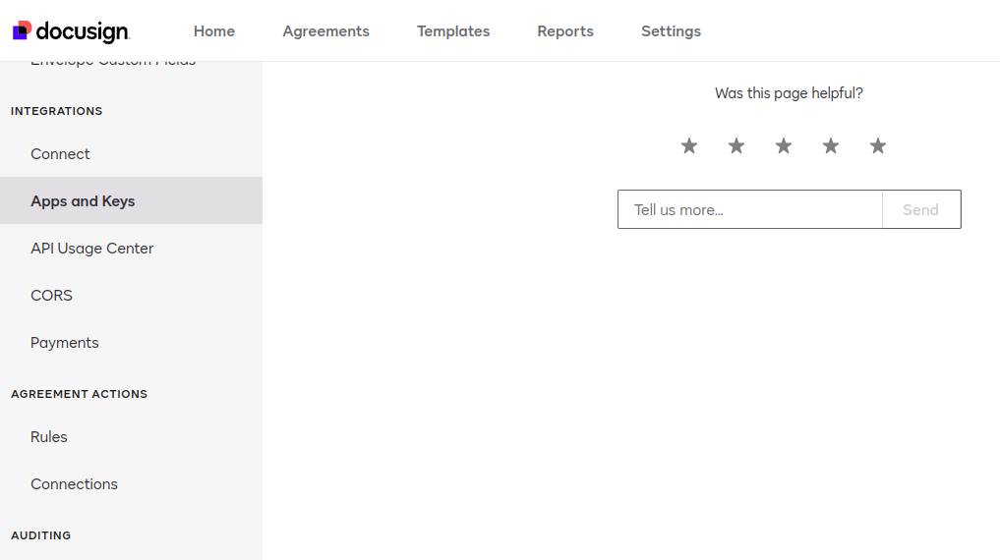 <br>

2. Add New App
    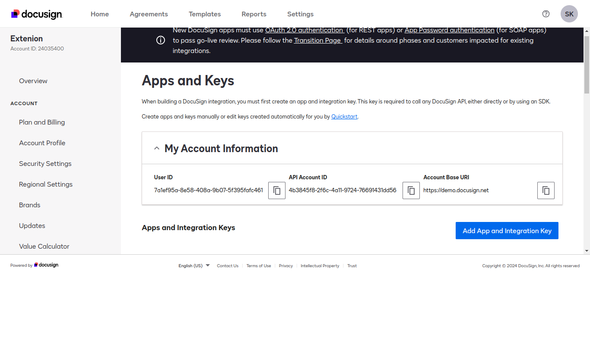 <br>

3. Find your Integration Key.
    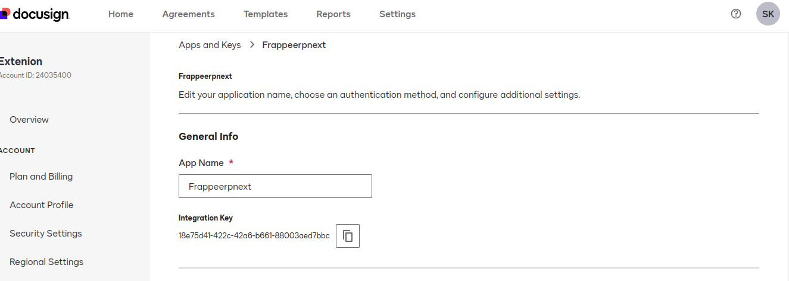 <br>

4. Genrate Secrate Key
    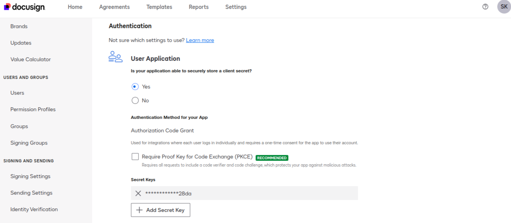 <br>

5. Add rediret Uri 
    ```bash
        <domain name > /api/method/dsc_erpnext.dsc_api.auth_login
    ```
    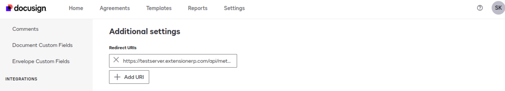<br>

6. And Save Configuration
    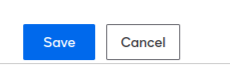<br>


## Webhook Setup on Docusign
1. Navigate Connect Section
    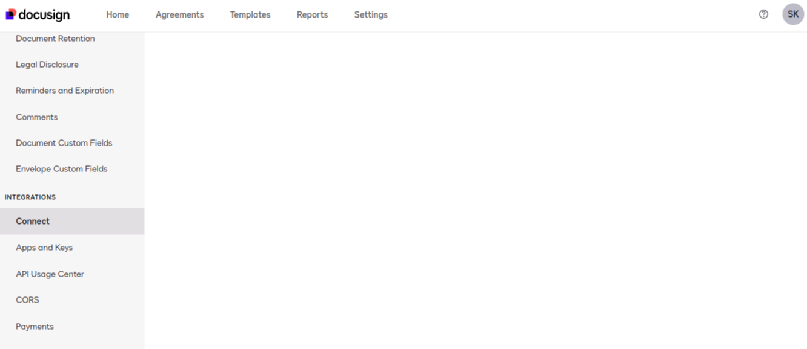<br>

2. Add Configuration
    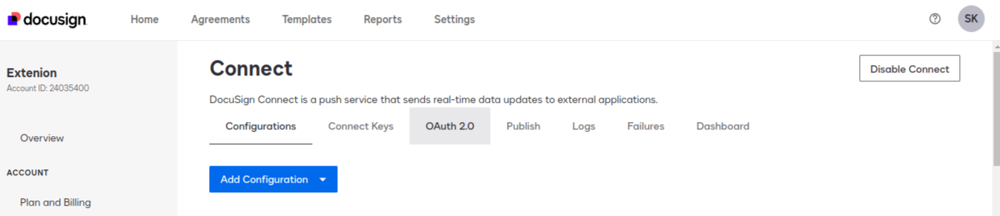<br>

3. Add Webhook Endpoint
    ```bash
         <Domain name>/api/method/dsc_erpnext.dsc_api.sign_document
    ```
    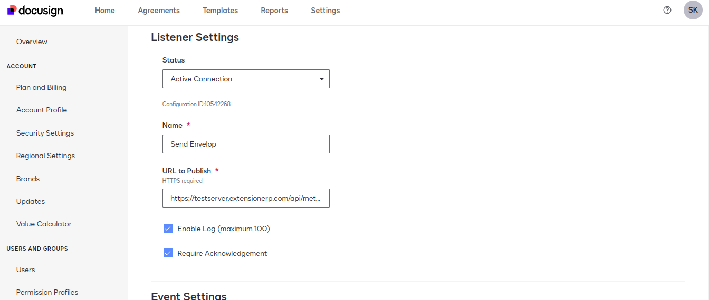 <br>

4. Trigger Event Setup
    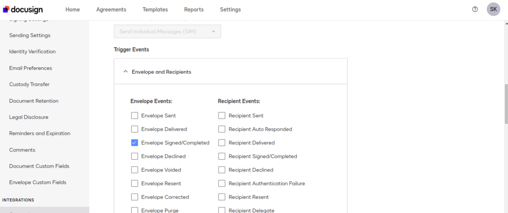


## Erpnext Configuration

In the Docusign Settings, provide the following configuration details:

* Account Id
* Client Id
* Secret Key
* Base Path
* Server URL

1. Find Docusign Settings 
    <br>
    And Add server url <domain name> it is requires <br>
    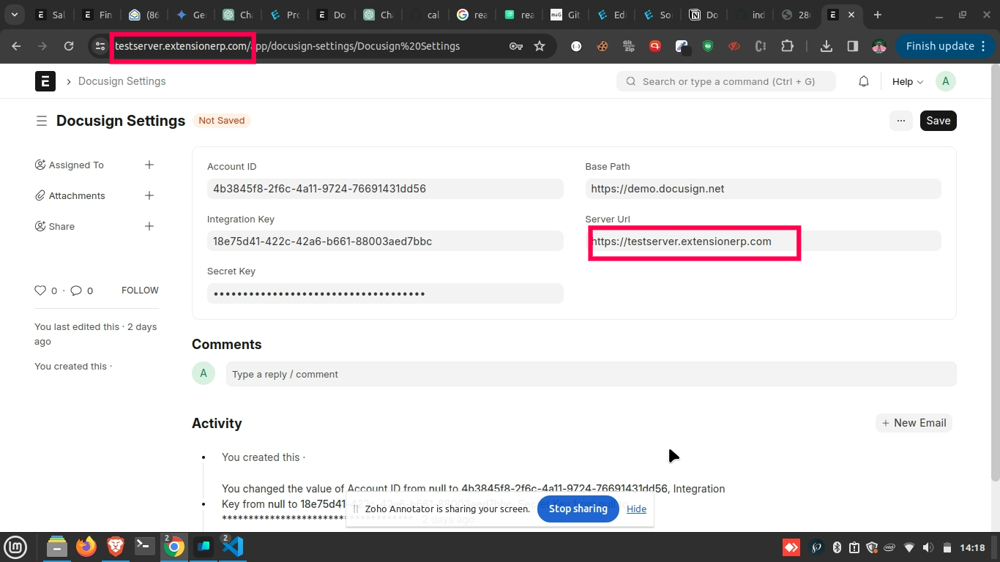<br>


## Digital Signature Document Setup
1. Find Digital Signature Document
    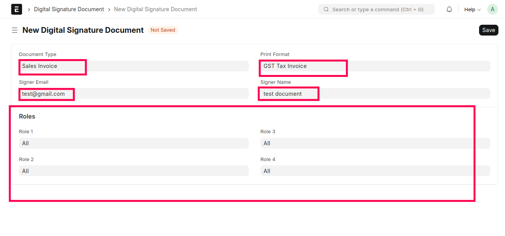<br>

2. Access the Digital Signature Document section.
3. Add a document and specify the format ready for signing.
4. Enter the signer's email or name and assign a role granting permission to sign the document.
5. Currently supported documents: Sales Invoice, Purchase Order.

## Document Signing Process

1. Create a sales invoice or purchase order and submit the document.
2. The submitted document will be available as "DSC Sales Invoice" or "DSC Purchase Order".
3. Click on the action button "DSC 1" to initiate the document signing process.
4. The document will be sent for signing to the designated email defined in the Digital Signature Document.

## Completion and Documentation Retrieval

1. Once the document envelope is completed, the respective document values will be received in the child table "Documents".
2. Access the signed document and certificate document via the provided links.

## Additional Notes

* Ensure all required configurations are accurately set up to ensure smooth integration.
* For any issues or inquiries, please refer to the documentation or contact support.
